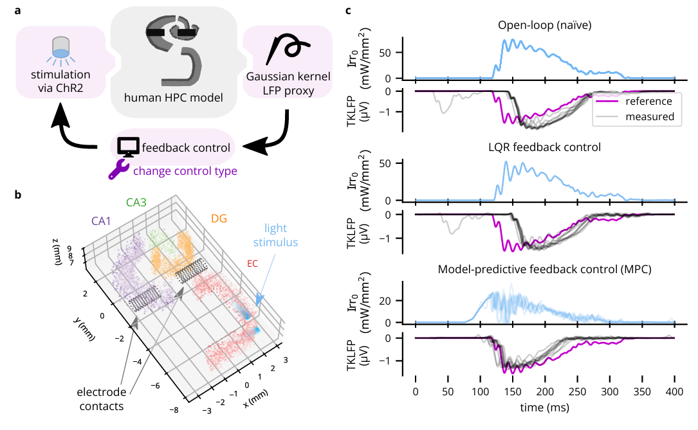

# [Cleo](https://cleosim.rtfd.io) paper virtual experiment 3
*evoking sharp wave-ripples with optogenetics*



This project takes the hippocampus model developed by Aussel et al. ([2018](https://link.springer.com/article/10.1007/s10827-018-0704-x), [2022](https://link.springer.com/epdf/10.1007/s10827-022-00829-5?sharing_token=Sw7RTIkQRaLgVO28K0KxNfe4RwlQNchNByi7wbcMAY7ikgvvZg602Tl3ZqpP40WLdqEJ2UxRZTBw0DOwGRH380A4Arj7YNkHR4M-sekgxxe7hOLNqxYR4Mo_zCbX_90PhEWk4ggVPRK-gbSfz4PGmOSwPO3auonOH3sXPFWmiG0%3D), [code](https://senselab.med.yale.edu/ModelDB/showmodel.cshtml?model=266796&file=/model_hipp_final/model_files/#tabs-1)), wraps it with [Cleo](https://cleosim.rtfd.io), and evokes SWRs with optogenetics rather than the original external current meant to model slow-wave sleep rhythms.

## Installation

Clone the repo, then use mamba (or conda if you must 😁):
```bash
mamba env create -f environment.yml
mamba activate hipp2
```
This creates an environment called `hipp2`&mdash;so called because the original simulation provided an environment called `hipp`.

If you have problems installing from the `environment.yml` file, try this instead:
```bash
mamba create -n hipp2 python=3.10
mamba install numpy scipy
pip install cleosim==0.18.1 seaborn pyvirtualdisplay cvxpy
```

Then install the model files as a package:
```bash
pip install -e ./aussel_model
```

To run LQR control, you'll need [`ldsctrlest` Python bindings](https://cloctools.github.io/lds-ctrl-est/docs/getting-started/getting-started/#python-bindings-package-ldsctrlest).

## Running experiments

Then, follow along with the experiments in `run_experiments.sh`. 
I haven't tested running that file all the way&mdash;rather, I added lines as I worked on the terminal. 
So, I'd recommend running line by line, especially since the simulations take a while (those with full optogenetics take about 10 minutes on my decent laptop).

## Plotting

Some plots are generated automatically by the simulation. That code is in `plot_results.py`. The code I used to make the final summary figure is in `create_figure.py`. 

## Validation experiment
The `--mode=val` argument runs the model with epilepsy parameters to reproduce figure 5A of [Aussel *et al.*, 2022](https://link.springer.com/article/10.1007/s10827-022-00829-5)
This relies on `validation/aussel22-data/input_epi_wake_{1|2|3}.txt`, which must be obtained by contacting Amélie Aussel, the author.
These files contain firing rate inputs to the entorhinal cortex from three different afferent brain regions, produced (after some preprocessing) from sEEG recordings as described in the two papers.
Code to produce a figure from these results is located at `validation/plot_data.py`.